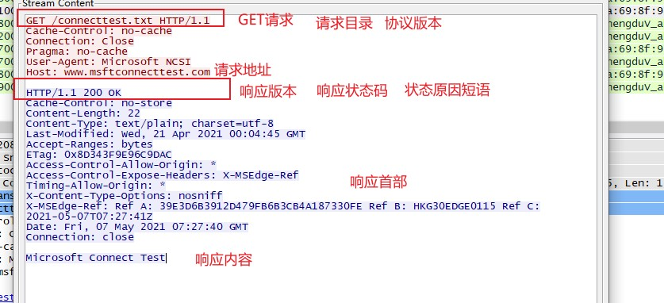

## HTTP协议

> HTTP协议和TCP/IP协议族内的许多协议相同，用于实现客户端与服务端之间的通信。

> 客户端先发出请求，服务端在没有接收到请求之前不会发出响应。请求报文内容如下，请求方法、请求URI、版本协议、可选的请求首部与请求内容实体组成。响应对应：起始行时协议版本号、状态码【status code】、原因短语【reason-phrase】。下一个是响应时间，是首部字段【header field】内容的一个属性。之后就是资源实体【ehtity body】.响应基本上由协议版本、状态码、原因短语、响应首部、响应实体组成

#### HTTP是不保存状态协议

> HTTP是一种无保存状态【stateless】,就是说HTTP协议对于发送的请求或响应都不做持久性处理。这是为了更快处理大量事务，确保协议的可伸缩性，特意把HTTP协议设计的这么简单。但由于HTTP不断的发展，因为无状态导致商业业务处理变得棘手，商业需要保证用户的状态持久性。于是就引进了Cookie技术，实现状态持久性

> HTTP使用URI让客户端定位到互联网资源，当客户发出请求时，URI需要将作为请求报文中的请求URI包含在内。如果不是访问特定资源而是访问服务器本身，可以用*来代替请求的URI

#### HTTP请求方法

+ GET:GET方法用来请求访问已经被URI识别的资源，指定服务端解析后返回响应。如果请求的资源时文本，那就原样返回，如果是像CGI(common gateway interface)那样的程序，则返回执行后的输出结果
+ POST：传输实体主体，虽然说GET可以传输实实体主体，但一般使用POST传输实体主体信息。
+ PUT：传输文件，要求在请求报文的主体中包含文件内容，然后保存到请求URI指定的位置。但是鉴于HTTP/1.1的PUT方法自身不带验证机制，任何人都可以上传文件，存在安全问题，因此Web网站一般不是使用该方法，若配合Web程序的验证机制，或架构设计采用REST(REpresentational status transfer,表征状态转移)标准的同类Web网站，可以开放使用PUT方法
+ HEAD：获取报文首部：HEAD方法与GET方法一样，只是不返回报文主体部分，用于确认URI的有效性以及资源更新的日期时间等
+ DELETE;删除文件：是与PUT相反的方法，DELETE按要URI请求删除指定资源，但是，HTTP1.1的DELETE同样不带验证机制，所以一般网站不使用该方法
+ OPTIONS：询问支持方法：用来查询针对请求URI指定的资源支持的方法
+ TRACE：追踪路径：让Web服务器端将之前的请求通信环回给客户端的方法。在发送请求时，在Max-Forwards首部字段中填入数值，每经过一个服务器就将该字段减一，当数值刚好减为0时，就停止继续传输。最后接收到请求的服务端则返回状态码200 OK的响应。客户端通过TRACE方法可以查询发送出去的请求是怎样被加工修改/篡改的。这是因为，请求想要连接到源目标服务器可能会通过代理中转，TRACE方法就是用来确认连接过程中发生的一系列操作。但是容易发生XST(cross-site tracing,跨站追踪)攻击，通常不会使用。
+ CONNECT：要求用隧道协议连接代理：CONNECT方法要求在与代理服务器通信时建立隧道，实现用隧道协议进行TCP通信。主要使用SSL(Secure Sockets Layers,安全套接层)和TLS(TransportLayer Security,传输层安全)协议把通信内容加密后经网络隧道传输

> 向请求URI指定的资源发送请求报文时，采用称为方法的命令。方法的作用在于，可以指定请求的资源按期望产生某种行为。

###### 持久连接节省通信量

> HTTP协议的初始版本中，每进行一次HTTP通信就要断开一次TCP连接。例如：使用浏览器浏览一个包含多张图片的HTML页面时，在发送请求访问HTML页面资源的同时，也会请求该HTML页面里包含的其他资源。因此，每次的请求都会造成无谓的TCP连接建立和断开，增加通信量的开销。

> 为了解决这一问题，HTTP/1.1和一部分HTTP/1.0想出了持久连接(HTTP Persistent Connections,也称为HTTP keep-alive或HTTP connection reuse)的方法.只要任意一端没有明确提出断开连接,则保持TCP连接状态.**持久连接旨在建立一次TCP连接后进行多次请求和响应的交互**优点:**减少了TCP重复的建立连接和断开造成的额外开销,减轻服务端的负载.另外,减少开销的那一部分时间,使HTTP请求和响应能够更早地结束,这样Web页面的显示速度也就相应提高**

> 管线化:持久连接使得多数请求以管线化(pipelining)方式发送成为可能.从前发送一个请求需要等待收到响应,才能发送下一个请求,管线化技术使得,不需要等待响应就可发送下一个请求

###### Cookie的状态管理

> HTTP是无状态协议,无法根据之前的状态进行本次的请求处理.保留无状态特征的同时又要解决状态话问题,于是就引入了Cookie技术.Cookie技术通过在请求和响应报文中写入Cookie信息来控制客户端的状态.Cookie会根据从服务端发送的响应报文内的一个叫做Set-Cookie的首部字段信息,通知客户端保存Cookie.当下次客户端再往该服务端发请求时,客户端会自动在请求报文中加入Cookie值后发送出去.服务端发现客户端发送的Cookie,会去检查究竟是从哪一个客户端发来的连接请求,然后对比服务器上的记录,得到之前的状态信息