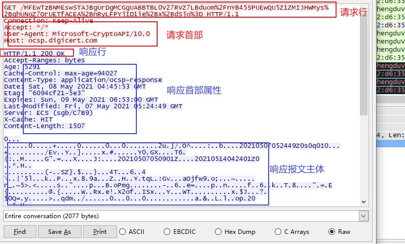

## HTTP报文内的HTTP信息

> HTTP协议交互的信息称为HTTP报文.请求端的HTTP报文叫做请求报文,响应端的叫做响应报文.HTTP报文本身是由多行(用CR+LF作换行符:CR:Carriage Return回车符 16进制0x0d;LF:Line Feed 换行符 16进制0x0a)数据构成的字符串文本.HTTP报文大致可以分为:**报文首部和报文主体两部分**.报文结构如下:

+ 请求行/响应状态行
+ 请求/响应首部字段
+ 通用首部字段
+ 实体首部字段
+ 空行
+ 报文主体

编码提升传输速率

> HTTP在传输数据时可以按照数据原貌直接传输,但也可以在传输过程通过编码提升传输速率.通过在传输时编码,能有效地处理大量地访问请求,但也就需要消耗更多地CPU资源

报文主体与实体主体

> 报文(message):是HTTP通信中最基本的单位,由8位组字节流组成,通过HTTP传输.实体(entity):作为请求或响应的有效载荷数据(补充项)被传输.内容由实体首部和实体主体组成.HTTP报文主体主要用于传输请求和响应的实体主体,通常,报文主体等于实体主体.只有当传输中进行编码操作时,实体主体内容发生了变化.才导致报文主体与实体主体存在差异

压缩传输与内容编码

> HTTP中有一种类似压缩功能的方法,被称为内容编码.内容编码指明应用在实体内容上的编码格式.并保持实体信息原样压缩,内容编码后由客户端解码.常见的内容编码格式如下:

+ gzip(GUN zip)
+ compress(UNIX 系统的标准压缩)
+ deflate(zlib)
+ identity(不进行编码)

分割发送的分块传输编码

> 在传输大容量数据时,通过把数据分割成多块,能够让浏览器逐步显示页面.这种把实体主体分块的功能称为分块传输编码(Chunked Transfer Coding).分块传输编码会将实体主体分成多个部分,每一块都会用十六进制来标记快的大小,而实体主体的最后一块会使用'0(CR+LF)'来标记.HTTP/1.1中存在一种称为传输编码(Transfer Coding)的机制,它可以在通信时按某种编码方式传输,但只定义作用于分块传输编码中.

> HTTP协议中采纳多部分对象集合，发送的一份报文主体内可以含有多类型实体。通常在图片或文本文件等上传时使用。多部分对象集合包含的对象如下：

+ multipart/form-data:在Web表单上传时使用
+ multipart/byteranges:状态码206(Partial Content,部分内容)响应报文包含了多个范围的内容时使用

> 在HTTP报文中使用多部分对象集合时，需要在首部字段里加上Content-type.使用boundary字符串来划分多部分对象集合指明的各类实体。在boundary字符串指定的各个实体的起始行之前插入‘--’标记，在多部分对象集合对应的字符串的最后插入‘--’标记作为结束

获取部分内容的范围请求

> 当传输失败时，需要一种可恢复的机制。所谓恢复机制就是指定从之前下载中断出恢复下载。这种请求叫做范围请求(Range Request).执行范围请求时，会用到首部字段Range来指定资源的byte范围，指定的形式如下：

+ Range: bytes=5001-10000【5001-10000字节】
+ Range: bytes=5001-【从5001字节之后的全部的】
+ Range: bytes=-3000, 5000-7000【从一开始到3000字节和5000-7000字节的多重范围】

> 范围请求的响应会返回状态码为206 Partial Content的响应报文。另外，对于多重范围的范围请求，响应会在首部字段Content-Type标明multipart/byteranges后返回响应报文。如果服务器无法响应范围请求，则会返回状态码200 ok和完整的实体内容

内容协商返回最合适的内容

> 当浏览器的默认语言为英文/中文，访问相同的URI的Web页面时，则会显示对应的英文版或中文版的Web页面。这样的机制称为内容协商(Content Negotiation).内容协商机制是指客户端和服务端就响应的资源内容进行交涉，然后提供给客户最为合适的资源。内容协商会以响应资源的语言、字符集、编码方式等作为判断的基准。包含在请求报文中的某些首部字段就是判断的基准，如下：

+ Accept
+ Accept-Charset
+ Accept-Encoding
+ Accept-Language
+ Content-Language

协商三种类型：

+ 服务器驱动协商(Server-driven Negotiation):由服务器端进行内容协商，以请求字段作为参考。但对于客户端来说，以浏览器发送的信息作为判断依据，并不一定能筛选出最优内容
+ 客户端驱动协商(Agent-driven Negotiation):由客户端进行内容协商方式。用户从浏览器显示可选项列表中手动选择。还可以利用JavaScript脚本在Web页面上自动进行选择。
+ 透明协商(Transparent Negotiation):是服务器驱动和客户端驱动结合体