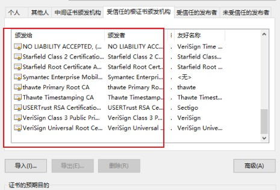

## 确保Web安全的HTTPS

> 在HTTP协议中有可能存在信息窃听盗取等安全问题。使用HTTPS可以有效的防止这些问题HTTP的缺点如下：

  + 使用明文传输
  + 不验证通信的身份，有可能遭遇到伪装
  + 无法验证报文的完整性

加密技术：

+ 通信的加密。HTTP可以通过和SSL(Secure SocketLayer,安全套接层)或TLS(TransportLayer Security,安全层传输协议)的组合使用加密HTTP通信内容
+ 内容的加密：是通信内容本身加密的方式。由于HTTP协议中没有加密机制，那么就对HTTP协议传输内容本身加密。即把HTTP报文内容进行加密，前提是要求客户端和服务器同时具有加密和解密机制。主要应用在Web服务中，由于此方法不同于SSL或TLS将整个通信线路加密处理，内容仍有被篡改的风险
+ 不验证通信方的身份的隐患：
  + 无法确定请求发送至目标的Web服务器是否是按真实意图返回响应的那台服务器。有可能是伪装的Web服务器
  + 无法确定响应返回到的客户端是否是按真实意图接收响应的那台客户端。可能是伪装的客户端
  + 无法确认正在通信的对方是否存在具备访问权限。因为有些重要信息，只想给特定用户通信的权限
  + 无法判断请求来之何方
  + 即使是无意义的请求也会接收，无法阻止海量请求下的DoS攻击(Denial Service,拒绝服务攻击)

证书

> SSL不仅提供加密处理，而且还使用了一种被称为证书的机制。证书是由第三方机构颁发，用以证明服务器和客户端是实际存在的。伪造证书技术是异常困难的。通使用证书，以证明通信双方，这对使用者来说，减少了个人信息泄露的危险。客户端持有证书既可以完成个人身份的确认，也可用于对Web网站的认证环节

HTTP + 加密 + 认证 + 完整性保护 = HTTPS

> 使用HTTPS通信时，改用https://。另外，当浏览器访问HTTPS通信有效的Web网站时，浏览器的地址栏会出现一个带锁的标记。但也会因浏览器的不同而发生改变，通常，HTTP直接和TCP通信。当使用SSL时，则演变成先和SSL通信，再由SSL和TCP通信了。就是身披SSL协议这层外壳。其它运行再应用层的协议都可以配合SSL协议使用。可以说SSH是当今最为广泛的安全技术

公开密钥和加密技术

> SSL采用一种叫做公开密钥加密(Public-key-crptography)的加密处理方式。

> 加密和解密同用一个密钥的方式称为共享密钥加密(Common-key-crypto-sytem),也被称为对称密钥加密。对称密钥加密的密钥分发成为了一个必须解决的问题(就是怎么把对称密钥安全的发送到对方)

> 公开密钥加密方式很好的解决了共享密钥加密的困难。公开密钥加密也叫做非对称加密，一把叫做公钥(public key),一把叫做私钥(private key),私钥不能让其他人知道，而公钥可以随意发布

> HTTPS采用混合加密机制。HTTPS采用共享密钥加密和公开密钥加密两者并用的混合加密。公钥实现共享密钥分发。之后的建立通信交换报文阶段则使用共享密钥加密方式

> 证明公开密钥正确性的证书。公开密钥的问题在于无法证明密钥本身就是货真价实的公开密钥。为了解决上述问题，可以使用由数字证书认证机构(CA，Certificate Authority)和其相关颁发的公开密钥证书。数字证书机构处于客户端与服务器双方都可信赖的第三方机构的立场上，威瑞信(VeriSign)就是其中一个数字证书机构，数字证书机构服务流程如下：**首先是服务器运用人员向数字证书机构提出公开密钥申请。然后，数字证书认证机构在判明提出申请者的身份之后，会对已申请的公开密钥做数字签名，分配这个已签名的公开密钥，并将该公开密钥放入公钥证书绑定在一起**之后服务器会将这份数字证书认证机构颁发的公钥证书发送给客户端，以进行公开密钥加密方式通信，公钥证书也可以叫做数字证书或直接称为证书。

> 接收到的证书的客户端，可以使用认证机构的公钥进行验证，一旦验证成功就可以判定正确性和不可抵赖性。此处认证机关的公开密钥必须安全地转换给客户端。因此，**多数浏览器开发商发布版本时，会事先在内部植入常用认证机关地公开密钥**

> 证明组织真实性的EV SSL证书。证书的一个作用就是证明通信一方服务器是否规范，另一个方面确认对方服务器背后运用的企业是否真实存在。拥有该特制的证书就是EV SSL证书(Extended ValidationSSL Certificate)EV SSL证书是基于国际标准的认证指导方针颁发的证书，其严格规定了对运营组织是否真实的确认方针。因此，通过认证的Web网站能够获得更高的认可度。持有EV SSL证书的Web网站的浏览器地址栏处的背景色是绿色的。

> 确认客户端的客户端证书。客户端证书存在几处问题，其中一个问题就是证书的获取和发布。想获取证书时，用户得自行安装客户端证书。但由于客户端证书需要付费购买，且每张证书对应到每位用户也就意味着需支付和用户对等的费用。现在，安全性极高的认证机构可以颁发客户端证书但仅用于特殊用途的业务，比如那些可以支撑客户端证书支出费用的业务。例如：网银，不仅需要验证客户的ID和密码，还需要验证客户端的证书.认证机构信誉，SSL机制中介入认证机构的原则是建立绝对可靠的信用。然而，2011年7月，荷兰一家DigNotar的认证机构被黑客入侵，颁布了网站的伪造证书。因为伪造证书上有正规机构的数字签名，所以浏览器会判定该证书合法，当伪造证书被用做服务器伪装时，用户根本无法察觉

> 虽然存在可将伪造证书无效化的证书吊销列表(Certificate Revocation List,CRL)机制，以及从客户端删除根证书颁发机构(Root Certificate Authority,RCA)，但在这个期段有多少用户蒙受损失就不可而知了

> 由自认证机构颁发的证书称为自签名证书。如果使用OpenSSL这套开源程序，每个人可以构建一套属于自己的认证机构，从而自己给自己颁发服务器证书，但该服务器证书在互联网不可作为证书使用。由自认证机构颁发的‘无用’证书也被戏称为自签名证书。浏览器访问该服务器时，会显示‘无法确认连接安全性’或‘该网站的安全证书存在问题’等安全警告有自认证机构颁发的服务器证书之所以不起作用，因为无法消除伪装的可能性值得信赖的第三方机构的介入，才能让已植入在浏览器内的认证机构颁发的公开密钥发挥作用。

> 中级认证机构的证书可能会变成自认证证书。多数浏览器内会预先植入备受信赖的认证机构的证书，但也有一小部分浏览器会植入中级认证机构的证书。对于中级认证机构颁发的服务器证书，某些浏览器会以正规的证书对待，可有的浏览器会当作自签名证书

HTTPS安全通信机制

> 主要的步骤如下：

  + 客户端发送Client Hello报文开始SSL通信，报文内容包含客户端支持的SSL指定版本、加密组件(Cipher Suite)列表(所使用的加密算法和密钥长度)。服务其会以Server Hello报文作为应答。服务器的加密组件内容是从接收到的客户端加密组件内筛选出来的
  + 之后服务器发送Certificate报文，包含公开密钥证书
  + 最后服务器发送Server Hello Done报文通知客户端，最初阶段的SSL握手协商部分结束
  + SSL第一次握手结束之后，客户端以Client Key Exchange报文作为回应。报文包含通信加密中使用的一种称为Pre-master secret的随机密码串。用公钥加密传输
  + 接着客户端继续发送Change Cipher Spec 报文，该报文会提示服务器，在此报文之后的通信会采用Pre-master secret密钥加密
  + 客户端发送Finished报文，报文包含连接至今全部报文的整体性校验值。这次握手协商是否能够成功，要以服务器是否能够正确解密该报文作为判定标准
  + 服务器同样发送Change Cipher Spec报文，再发送Finished报文
  + 服务器和客户端的Finished报文交换完毕之后，SSL连接就算建立完成。当然，通信会受到SSL的保护。从此处开始进入应用层协议通信，即发送HTTP
  + 最后由客户端断开连接，断开连接时发送close-notify报文，之后发送TCP FIN报文来关闭与TCP的通信

> 以上流程，应用层发送数据时会附加一种叫做MAC(Message Authentication Code)的报文摘要。MAC能够查知报文是否遭受篡改，从而保护报文的完整性

> SSL和TLS。SSL技术最初是由浏览器开发商网景通信公司率先倡导的，开发过SSL3.0之前的版本。目前主导权已经转移到IETF(Internet Engineering Task Force,internet工程任务组)的手中。IETF以SSL3.0为基准，后制定了TLS1.0、TLS1.1和TLS1.2。TSL是以SSL为原型开发的协议，有时会统一称该协议为SSL。由于SSL1.0和SSL2.0都被发现存在问题，所以很多浏览器直接废除了该协议版本

> SSL慢有两种，一种是指通信慢。另一种是指由于大量消耗CPU及内存等资源，导致处理速度变慢。和使用HTTP相比，网络负载可能变慢2到100倍。除去和TCP连接、发送HTTP请求.响应以外，还必须进行SSL通信，因此整体上处理通信量不可避免会增加，另一点就是服务端和客户端需要进行加密和解密操作。针对速度变慢这一问题，并没有根本性的解决方案，会使用SSL加速器这种(专门服务器)硬件来改善问题，该硬件为SSL通信专用硬件，相对软件来讲，能提高数倍SSL的计算速度，仅在SSL处理时发挥SSL加速器的功效，以分担负载

> 不一直进行加密通信的原因有：消耗更多的CPU及内存资源，节约购买证书的开销
